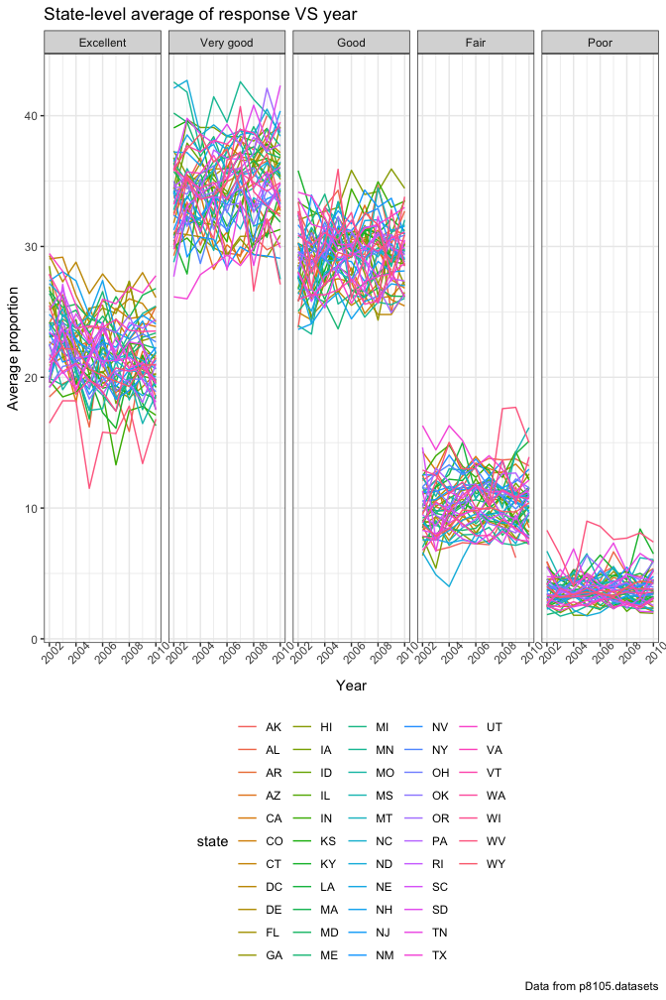
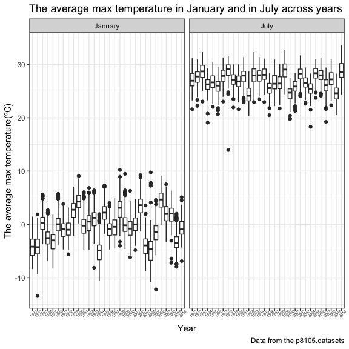
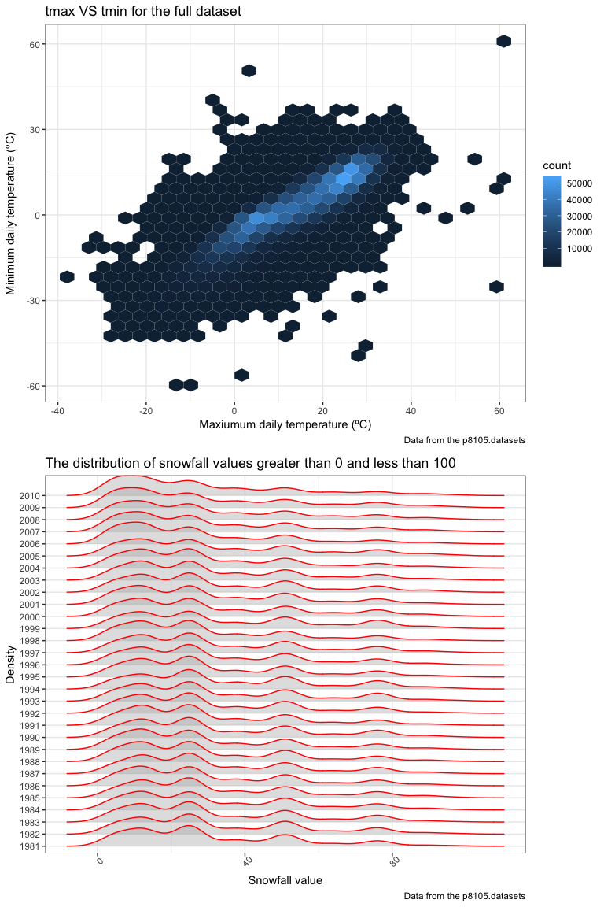

p8105\_hw3\_sl4471
================
Shuwei Liu sl4471
10.13.2018

Problem1
========

1.1 Import and Clean the data
-----------------------------

``` r
devtools::install_github("p8105/p8105.datasets")
```

    ## Skipping install of 'p8105.datasets' from a github remote, the SHA1 (21f5ad1c) has not changed since last install.
    ##   Use `force = TRUE` to force installation

``` r
library(p8105.datasets)
data("brfss_smart2010")
overall_health_df = 
  janitor::clean_names(brfss_smart2010) %>%
  rename(state = "locationabbr") %>% 
  filter(topic == "Overall Health") %>% 
  mutate(response = factor(response, levels = str_c(
    c("Excellent", "Very good", "Good", "Fair", "Poor"))))
```

1.2 In 2002, which states were observed at 7 locations?
-------------------------------------------------------

``` r
data_2002 = 
  filter(overall_health_df, year == "2002") %>% 
  group_by(state) %>% 
  summarize(n_obs = n(),
            n_loc = n_distinct(locationdesc)) %>% 
  select(state, n_loc) %>% 
  filter(n_loc == "7")
```

In the year 2002, state Connecticut, Florida and North Carolina were observed at 7 locations.

1.3 Spaghetti plot
------------------

``` r
number_locations_df = 
  overall_health_df %>% 
  group_by(state, year) %>% 
  summarise(n_obs = n(), n_loc = n_distinct(locationdesc))
ggplot(number_locations_df, aes(x = year, y = n_loc, color = state)) +
  geom_line() +
  labs(
    title = "Number of locations in each state from 2002 to 2010",
    x = "number of locations",
    y = "year") +
  theme_bw() +
  theme(legend.position = "bottom")
```


I chose "geom\_line" for the "spaghetti plot" since we need to show the changes of the number of locations in different states over years. The line plot could not only display the trend for changes of each states but also compare the number of locations between the states. From the plot, we can tell that most of the states have a stable change and some of them did not have a different number of locations over years. Florida has a disctint change of the number.

1.4 Table for the proportion of "Excellent" in NY
-------------------------------------------------

``` r
NY_data = 
overall_health_df %>% 
  group_by(year) %>%
  filter(state == "NY", response == "Excellent", year %in% c(2002, 2006, 2010)) %>% 
  summarise(excellent_mean = mean(data_value, na.rm =  TRUE), 
            excellent_sd = sd(data_value, na.rm =  TRUE)) %>% 
  knitr::kable(digits = 1)
NY_data
```

|  year|  excellent\_mean|  excellent\_sd|
|-----:|----------------:|--------------:|
|  2002|             24.0|            4.5|
|  2006|             22.5|            4.0|
|  2010|             22.7|            3.6|

From above, the mean of the proportion of "Excellent" response has decreased from 24% to 22.7%. However, the standard deviation of it also decreased which means that the range of the data for 2010 is smaller then the range of that for 2002.

1.5 The distribution of state-level averages over time
------------------------------------------------------

``` r
avearge_proportion_df = 
  overall_health_df %>% 
  group_by(state, year, response) %>%
  summarise(mean = mean(data_value, na.rm = TRUE))
ggplot(avearge_proportion_df, aes(x = year, y = mean, color = state)) +
  geom_line() +
  facet_grid(~response) +
  labs(
    title = "State-level average of response VS year",
    x = "Year",
    y = "Average proportion",
    caption = "Data from p8105.datasets") +
  theme_bw() +
  theme(legend.position = "bottom") +
  theme(axis.text.x = element_text(angle = 45))
```



Each state has fairly same average proportion for each response. The "Very good" Response has the highest proportion while the "Poor" response has the least.

Problem2
--------

2.1 Description of dataset
--------------------------

``` r
data("instacart")
str(instacart)
```

    ## Classes 'tbl_df', 'tbl' and 'data.frame':    1384617 obs. of  15 variables:
    ##  $ order_id              : int  1 1 1 1 1 1 1 1 36 36 ...
    ##  $ product_id            : int  49302 11109 10246 49683 43633 13176 47209 22035 39612 19660 ...
    ##  $ add_to_cart_order     : int  1 2 3 4 5 6 7 8 1 2 ...
    ##  $ reordered             : int  1 1 0 0 1 0 0 1 0 1 ...
    ##  $ user_id               : int  112108 112108 112108 112108 112108 112108 112108 112108 79431 79431 ...
    ##  $ eval_set              : chr  "train" "train" "train" "train" ...
    ##  $ order_number          : int  4 4 4 4 4 4 4 4 23 23 ...
    ##  $ order_dow             : int  4 4 4 4 4 4 4 4 6 6 ...
    ##  $ order_hour_of_day     : int  10 10 10 10 10 10 10 10 18 18 ...
    ##  $ days_since_prior_order: int  9 9 9 9 9 9 9 9 30 30 ...
    ##  $ product_name          : chr  "Bulgarian Yogurt" "Organic 4% Milk Fat Whole Milk Cottage Cheese" "Organic Celery Hearts" "Cucumber Kirby" ...
    ##  $ aisle_id              : int  120 108 83 83 95 24 24 21 2 115 ...
    ##  $ department_id         : int  16 16 4 4 15 4 4 16 16 7 ...
    ##  $ aisle                 : chr  "yogurt" "other creams cheeses" "fresh vegetables" "fresh vegetables" ...
    ##  $ department            : chr  "dairy eggs" "dairy eggs" "produce" "produce" ...
    ##  - attr(*, "spec")=List of 2
    ##   ..$ cols   :List of 15
    ##   .. ..$ order_id              : list()
    ##   .. .. ..- attr(*, "class")= chr  "collector_integer" "collector"
    ##   .. ..$ product_id            : list()
    ##   .. .. ..- attr(*, "class")= chr  "collector_integer" "collector"
    ##   .. ..$ add_to_cart_order     : list()
    ##   .. .. ..- attr(*, "class")= chr  "collector_integer" "collector"
    ##   .. ..$ reordered             : list()
    ##   .. .. ..- attr(*, "class")= chr  "collector_integer" "collector"
    ##   .. ..$ user_id               : list()
    ##   .. .. ..- attr(*, "class")= chr  "collector_integer" "collector"
    ##   .. ..$ eval_set              : list()
    ##   .. .. ..- attr(*, "class")= chr  "collector_character" "collector"
    ##   .. ..$ order_number          : list()
    ##   .. .. ..- attr(*, "class")= chr  "collector_integer" "collector"
    ##   .. ..$ order_dow             : list()
    ##   .. .. ..- attr(*, "class")= chr  "collector_integer" "collector"
    ##   .. ..$ order_hour_of_day     : list()
    ##   .. .. ..- attr(*, "class")= chr  "collector_integer" "collector"
    ##   .. ..$ days_since_prior_order: list()
    ##   .. .. ..- attr(*, "class")= chr  "collector_integer" "collector"
    ##   .. ..$ product_name          : list()
    ##   .. .. ..- attr(*, "class")= chr  "collector_character" "collector"
    ##   .. ..$ aisle_id              : list()
    ##   .. .. ..- attr(*, "class")= chr  "collector_integer" "collector"
    ##   .. ..$ department_id         : list()
    ##   .. .. ..- attr(*, "class")= chr  "collector_integer" "collector"
    ##   .. ..$ aisle                 : list()
    ##   .. .. ..- attr(*, "class")= chr  "collector_character" "collector"
    ##   .. ..$ department            : list()
    ##   .. .. ..- attr(*, "class")= chr  "collector_character" "collector"
    ##   ..$ default: list()
    ##   .. ..- attr(*, "class")= chr  "collector_guess" "collector"
    ##   ..- attr(*, "class")= chr "col_spec"

``` r
dim(instacart)
```

    ## [1] 1384617      15

We can use "str()" and "dim" to look through the dataset. This a "tbl\_df" data with 1384617 rows and 15 columns. It includes "order\_id", "product\_id", "add\_to\_cart\_order", "reordered", "user\_id", "eval\_set", "order\_number", "order\_dow", "order\_hour\_of\_day", "days\_since\_prior\_order", "product\_name", "aisle\_id", "department\_id", "aisle" and "department" variables. Basically, it tells us "who" order "what" kind of product under "which" aisle and department if it is reordered or not. To be specific, just take the first row as an example, the order id "1" shows that customer "112108" reordered "Bulgarian Yogurt" whose id is "49302" under the yogurt aisle whose id is "120" from the "dairy eggs" department whose id is "16" at 10am on Thursday as this customers first order this time. This order was 9 days after since the customer's last one.

``` r
count(distinct(instacart, aisle))
```

    ## # A tibble: 1 x 1
    ##       n
    ##   <int>
    ## 1   134

``` r
instacart %>% 
  janitor::clean_names() %>% 
  group_by(aisle) %>% 
  summarize(n_obs = n()) %>% 
  arrange(desc(n_obs))
```

    ## # A tibble: 134 x 2
    ##    aisle                          n_obs
    ##    <chr>                          <int>
    ##  1 fresh vegetables              150609
    ##  2 fresh fruits                  150473
    ##  3 packaged vegetables fruits     78493
    ##  4 yogurt                         55240
    ##  5 packaged cheese                41699
    ##  6 water seltzer sparkling water  36617
    ##  7 milk                           32644
    ##  8 chips pretzels                 31269
    ##  9 soy lactosefree                26240
    ## 10 bread                          23635
    ## # ... with 124 more rows

There are 134 aisles and "fresh vegetables" is the most items ordered from.

2.2 The number of items ordered in each aisle
---------------------------------------------

``` r
instacart %>% 
  group_by(aisle) %>% 
  ggplot(aes(x = aisle, fill = department)) +
  geom_bar(width = 1) +
  labs(
    title = "Number of product ordered",
    x = "aisle name",
    y = "number of product ordered") +
  theme_bw() +
  theme(legend.position = "bottom") +
  theme(axis.text.x = element_text(size = 6, angle = 90, hjust = 1))
```


The range of the number of product is so large that it cannot be displayed readable in a plot. So I separate it into 6 plot by different aisle id.

``` r
number_product_1 =
  instacart %>% 
  group_by(aisle_id) %>% 
  filter(aisle_id <= 23) %>% 
  ggplot(aes(x = aisle_id)) +
  geom_histogram() +
  labs(
    title = "Number of product ordered(aisle_id = 1-23)",
    x = "aisle id",
    y = "number of product ordered") +
  theme_bw() 

number_product_2 =
  instacart %>% 
  group_by(aisle_id) %>% 
  filter(aisle_id <= 46, aisle_id > 23) %>% 
  ggplot(aes(x = aisle_id)) +
  geom_histogram() +
  labs(
    title = "Number of product ordered(aisle_id = 24-46)",
    x = "aisle id",
    y = "number of product ordered") +
  theme_bw() 

number_product_3 =
  instacart %>% 
  group_by(aisle_id) %>% 
  filter(aisle_id <= 69, aisle_id > 46) %>% 
  ggplot(aes(x = aisle_id)) +
  geom_histogram() +
  labs(
    title = "Number of product ordered(aisle_id = 47-69)",
    x = "aisle id",
    y = "number of product ordered") +
  theme_bw() 

number_product_4 =
  instacart %>% 
  group_by(aisle_id) %>% 
  filter(aisle_id <= 92, aisle_id > 69) %>% 
  ggplot(aes(x = aisle_id)) +
  geom_histogram() +
  labs(
    title = "Number of product ordered(aisle_id = 70-92)",
    x = "aisle id",
    y = "number of product ordered") +
  theme_bw() 

number_product_5 =
  instacart %>% 
  group_by(aisle_id) %>% 
  filter(aisle_id <= 115 , aisle_id > 92) %>% 
  ggplot(aes(x = aisle_id)) +
  geom_histogram() +
  labs(
    title = "Number of product ordered(aisle_id = 93-115)",
    x = "aisle id",
    y = "number of product ordered") +
  theme_bw() 

number_product_6 =
  instacart %>% 
  group_by(aisle_id) %>% 
  filter(aisle_id <= 134, aisle_id > 115) %>% 
  ggplot(aes(x = aisle_id)) +
  geom_histogram() +
  labs(
    title = "Number of product ordered(aisle_id = 115-134)",
    x = "aisle id",
    y = "number of product ordered") +
  scale_x_continuous(
    breaks = c(115, 120, 125, 130, 135),
    labels = c("115", "120", "125", "130", "135")
  ) +
  theme_bw() 

(number_product_1 + number_product_2) / (number_product_3 + number_product_4) / (number_product_5 + number_product_6)
```

    ## `stat_bin()` using `bins = 30`. Pick better value with `binwidth`.
    ## `stat_bin()` using `bins = 30`. Pick better value with `binwidth`.
    ## `stat_bin()` using `bins = 30`. Pick better value with `binwidth`.
    ## `stat_bin()` using `bins = 30`. Pick better value with `binwidth`.
    ## `stat_bin()` using `bins = 30`. Pick better value with `binwidth`.
    ## `stat_bin()` using `bins = 30`. Pick better value with `binwidth`.


2.3 Table of the most popular item
----------------------------------

``` r
instacart %>% 
  filter(aisle %in% c("baking ingredients", "dog food care", "packaged vegetables fruits")) %>% 
  group_by(aisle, product_name) %>% 
  summarize(n_product = n()) %>% 
  filter(min_rank(desc(n_product)) == 1) %>% 
  select(aisle, product_name) %>% 
  knitr::kable(digits = 1)
```

| aisle                      | product\_name                                 |
|:---------------------------|:----------------------------------------------|
| baking ingredients         | Light Brown Sugar                             |
| dog food care              | Snack Sticks Chicken & Rice Recipe Dog Treats |
| packaged vegetables fruits | Organic Baby Spinach                          |

From the table, the most popular item of "baking ingredients" is "Light Brown Sugar". "Snack Sticks Chicken & Rice Recipe Dog Treats" and "Organic Baby Spinash" are the most popular items of "dog food care" and "packaged vegetables fruits" respectively.

2.4 Table of the mean hour of the day
-------------------------------------

``` r
instacart %>% 
  filter(product_name == "Pink Lady Apples" | product_name == "Coffee Ice Cream") %>% 
  group_by(product_name, order_dow) %>% 
  summarize(hours_mean = mean(order_hour_of_day, na.rm = TRUE)) %>% 
  spread(key = order_dow, value = hours_mean) %>%
  rename('Sun.' = '0', 'Mon.' = '1', 'Tue.' = '2', 
         'Wed.' = '3', 'Thu.' = '4', 'Fri.' = '5', 'Sat.' = '6') %>% 
  knitr::kable(digits = 1)
```

| product\_name    |  Sun.|  Mon.|  Tue.|  Wed.|  Thu.|  Fri.|  Sat.|
|:-----------------|-----:|-----:|-----:|-----:|-----:|-----:|-----:|
| Coffee Ice Cream |  13.8|  14.3|  15.4|  15.3|  15.2|  12.3|  13.8|
| Pink Lady Apples |  13.4|  11.4|  11.7|  14.2|  11.6|  12.8|  11.9|

Problem 3
=========

3.1 Description of dataset
--------------------------

``` r
data("ny_noaa")
str(ny_noaa)
```

    ## Classes 'tbl_df', 'tbl' and 'data.frame':    2595176 obs. of  7 variables:
    ##  $ id  : chr  "US1NYAB0001" "US1NYAB0001" "US1NYAB0001" "US1NYAB0001" ...
    ##  $ date: Date, format: "2007-11-01" "2007-11-02" ...
    ##  $ prcp: int  NA NA NA NA NA NA NA NA NA NA ...
    ##  $ snow: int  NA NA NA NA NA NA NA NA NA NA ...
    ##  $ snwd: int  NA NA NA NA NA NA NA NA NA NA ...
    ##  $ tmax: chr  NA NA NA NA ...
    ##  $ tmin: chr  NA NA NA NA ...
    ##  - attr(*, "spec")=List of 2
    ##   ..$ cols   :List of 7
    ##   .. ..$ id  : list()
    ##   .. .. ..- attr(*, "class")= chr  "collector_character" "collector"
    ##   .. ..$ date:List of 1
    ##   .. .. ..$ format: chr ""
    ##   .. .. ..- attr(*, "class")= chr  "collector_date" "collector"
    ##   .. ..$ prcp: list()
    ##   .. .. ..- attr(*, "class")= chr  "collector_integer" "collector"
    ##   .. ..$ snow: list()
    ##   .. .. ..- attr(*, "class")= chr  "collector_integer" "collector"
    ##   .. ..$ snwd: list()
    ##   .. .. ..- attr(*, "class")= chr  "collector_integer" "collector"
    ##   .. ..$ tmax: list()
    ##   .. .. ..- attr(*, "class")= chr  "collector_character" "collector"
    ##   .. ..$ tmin: list()
    ##   .. .. ..- attr(*, "class")= chr  "collector_character" "collector"
    ##   ..$ default: list()
    ##   .. ..- attr(*, "class")= chr  "collector_guess" "collector"
    ##   ..- attr(*, "class")= chr "col_spec"

``` r
dim(ny_noaa)
```

    ## [1] 2595176       7

This "ny\_noaa" dataset includes weather data from all New York state weather stations between 1981 and 2010. It is a "tbl\_df" dataset with 2595176 rows \* 7 columns. It contains 7 variables which is "id", "date", "prcp", "snow", "snwd", "tmax" and "tmin" where "prcp" stands for precipitation with unit "tenths of mm", "snow" stands for snowfall with unit "mm", "snwd" stands for snow depth with unit "mm", "tmax" stands for maximum temperature with unit "tenths of degrees C", "tmin" stands for minimum temperature with unit "tenths of degrees C".

3.2 Data cleaning
-----------------

``` r
ny_noaa_tidy = 
  ny_noaa %>%
  janitor::clean_names() %>% 
  separate(date, into = c("year", "month", "date"), sep = "-") %>%
  mutate(prcp = as.numeric(prcp)/10, tmax = as.numeric(tmax)/10, tmin = as.numeric(tmin)/10)
ny_noaa_tidy %>% 
  group_by(snow) %>% 
  summarize(n = n()) %>% 
  arrange(desc(n))
```

    ## # A tibble: 282 x 2
    ##     snow       n
    ##    <int>   <int>
    ##  1     0 2008508
    ##  2    NA  381221
    ##  3    25   31022
    ##  4    13   23095
    ##  5    51   18274
    ##  6    76   10173
    ##  7     8    9962
    ##  8     5    9748
    ##  9    38    9197
    ## 10     3    8790
    ## # ... with 272 more rows

Because the unit of "prcp" is "tenths of mm", the units of "tmax" and "tmin" are "tenths of degrees C", I change the unit more reasonable.

The most commonly observed value of snowfall is 0. Snowfall only takes place in winter, so for the most time of a year it would not happen.

3.3 The plots
-------------

### 3.3.1

``` r
ny_noaa_meantmax = 
  ny_noaa_tidy %>% 
  select(id, year, month, tmax) %>% 
  filter(month %in% c("01", "07")) %>% 
  mutate(month = recode(month, `01` = "January", `07` = "July")) %>% 
  group_by(id, year, month) %>% 
  summarize(tmax_mean = mean(tmax, na.rm = TRUE))

ggplot(ny_noaa_meantmax, aes(x = year, y = tmax_mean)) +
  geom_boxplot() +
  facet_grid(~month) +
  labs(
    title = "The average max temperature in January and in July across years",
    x = "Year", 
    y = "The average max temperature(ºC)",
    caption = "Data from the p8105.datasets"
  ) +
  theme_bw() +
  theme(axis.text.x = element_text(size = 5, angle = 45))
```

    ## Warning: Removed 5970 rows containing non-finite values (stat_boxplot).



We can use "boxplot.stats()" function to check the outliers.

``` r
ny_noaa_meantmax %>%
  filter(month == "January") %>% 
  .$tmax_mean %>% 
  boxplot.stats()
```

    ## $stats
    ## [1] -9.9806452 -2.7451613 -0.2016129  2.1209677  9.2366667
    ## 
    ## $n
    ## [1] 4080
    ## 
    ## $conf
    ## [1] -0.32198079 -0.08124502
    ## 
    ## $out
    ##  [1] -13.438710  10.215385 -10.622581 -12.200000 -10.787097   9.490476
    ##  [7]   9.750000 -10.180645 -10.412903 -10.392857

``` r
ny_noaa_meantmax %>%
  filter(month == "July") %>% 
  .$tmax_mean %>% 
  boxplot.stats()
```

    ## $stats
    ## [1] 21.48667 25.59333 27.00645 28.36774 32.51765
    ## 
    ## $n
    ## [1] 4061
    ## 
    ## $conf
    ## [1] 26.93766 27.07524
    ## 
    ## $out
    ##  [1] 21.31290 20.80968 21.41290 21.30645 21.42903 21.32581 18.30000
    ##  [8] 20.65714 21.04194 21.26774 21.31613 33.60000 21.32581 20.51290
    ## [15] 20.72414 20.80645 21.06129 21.09677 19.75806 20.79032 20.40968
    ## [22] 20.49677 20.40357 21.29032 20.71613 20.31613 19.87742 20.89677
    ## [29] 19.08387 32.66452 13.95161 20.93571 32.77097 19.22258 32.57419

From the plot, we can compare the average of max temperature on January with that on July across years. We the tell the basic descripttive data of each including range, Q1, median, Q3.

### 3.3.2

``` r
tmax_tmin = 
  ggplot(ny_noaa_tidy, aes(x = tmax, y = tmin)) + 
  geom_hex() +
  labs(
    title = "tmax VS tmin for the full dataset",
    x = "Maxiumum daily temperature (ºC)",
    y = "Minimum daily temperature (ºC)",
    caption = "Data from the p8105.datasets"
  ) +
  viridis::scale_color_viridis(discrete = TRUE) +
  theme_bw() +
  theme(legend.position = "right") 

distribution_snow =
  ny_noaa_tidy %>% 
  filter(snow > 0, snow < 100) %>% 
  ggplot(aes(x = snow, fill = year)) + 
  geom_density(alpha = .4, adjust = .4, color = "blue") +
  labs(
    title = "The distribution of snowfall values greater than 0 and less than 100",
    x = "Snowfall value",
    y = "Density",
    caption = "Data from the p8105.datasets"
  ) +
  theme_bw() +
  theme(legend.position = "bottom") +
  theme(axis.text.x = element_text(angle = 45))

(tmax_tmin)/(distribution_snow)
```

    ## Warning: Removed 1136276 rows containing non-finite values (stat_binhex).



I chose "geom\_hex" for the first plot since it could show the highest frequency values which is the light blue part on the plot. And I chose "geom\_density" to show the distribution of snowfall values greater than 0 and less than 100. Boxplot is easier to compare the distribution over years and can easily identify the outliers.
